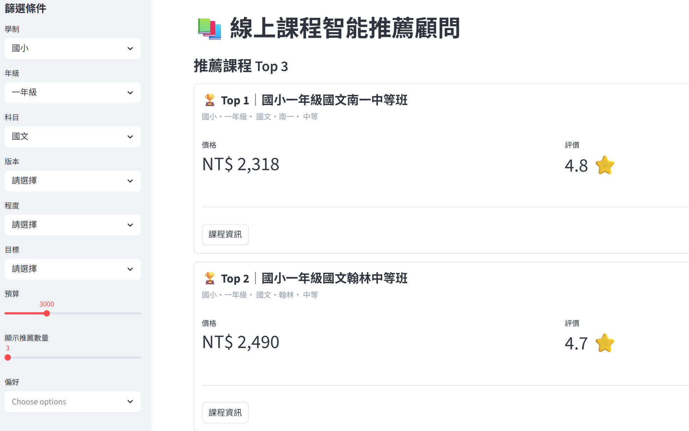
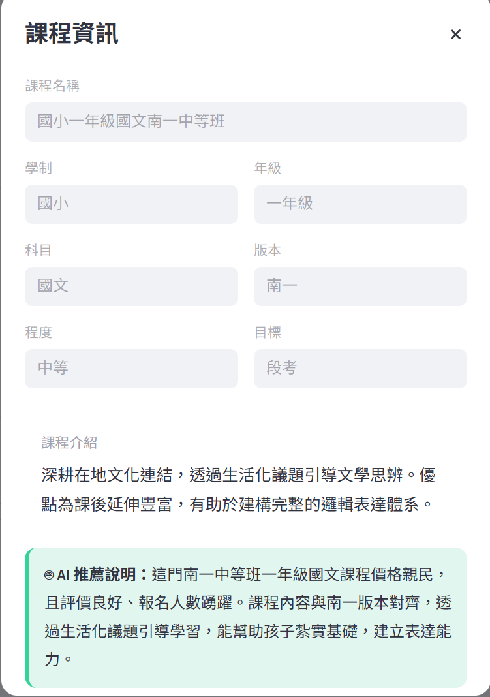

# Online Course Streamlit Frontend

線上課程智能推薦顧問 - Streamlit Frontend

本專案為課程推薦系統前端，使用 Python + Streamlit 開發，透過呼叫 FastAPI 後端 API 顯示課程推薦結果與 AI 分析內容。

---

# Demo Features

- 課程條件篩選
- 課程推薦結果顯示
- AI 推薦原因分析
- 課程評分與人數視覺化
- FastAPI API 串接
- Docker 部署
- GCP Cloud Run 部署

---

# Tech Stack

- Python 3.12.13
- Streamlit
- Requests
- Docker
- GCP Cloud Run

---

# Project Structure

```bash
ONLINE-COURSE-STREAMLIT-FRONTEND/
│
├── api/
├── components/
├── config/
├── enums/
├── services/
├── utils/
│
├── .env                  # Environment variables
├── app.py                # Streamlit application entry point
├── Dockerfile            # Docker build configuration
├── README.md             # Project documentation
└── requirements.txt      # Python dependencies
```

---

# Environment Setup

## Create Environment (Optional)

### Conda

```bash
conda create -n your-env-name python=3.12.13

conda activate your-env-name
```

### Virtual Environment

```bash
python -m venv venv
```

#### Windows CMD

```bash
venv\Scripts\activate
```

#### Windows PowerShell

```powershell
.\venv\Scripts\Activate.ps1
```

#### Linux / macOS

```bash
source venv/bin/activate
```

---

# Check Python Version

```bash
python -V
```

Expected:

```bash
Python 3.12.13
```

---

# Install Packages

```bash
pip install -r requirements.txt
```

---

# Important

## FastAPI Backend Must Start First

請先啟動 FastAPI 專案，否則 Streamlit 無法取得 API 資料。

預設 API：

```bash
http://127.0.0.1:8000
```

---

# Run Streamlit

```bash
streamlit run app.py
```

---

# Environment Variables

建立 `.env`

```env
API_BASE_URL=http://127.0.0.1:8000
```

---

# Docker

## Build Docker Image

```bash
docker build -t course-web:latest .
```

## Run Docker Container

```bash
docker run --rm -p 8501:8080 ^
  -e PORT=8080 ^
  -e API_BASE_URL=http://host.docker.internal:8000 ^
  course-web
```

---

# GCP Cloud Run Deploy

## Deploy Streamlit Service

```bash
gcloud run deploy streamlit-service ^
  --image asia-east1-docker.pkg.dev/YOUR_PROJECT_ID/YOUR_REPOSITORY/course-web:latest ^
  --platform managed ^
  --region asia-east1 ^
  --allow-unauthenticated ^
  --port 8501 ^
  --set-env-vars API_BASE_URL=產生的API_BASE_URL
```

---

# API Example

## Get Schools

```bash
GET /api/options/schools
```

## Get Courses

```bash
GET /api/courses
```

---

# Screenshot




---

# Notes

- 本專案為前端 UI 專案
- 後端 API 使用 FastAPI
- 推薦邏輯與 AI 分析於後端處理
- Streamlit 負責資料呈現與互動

---

# License

This project is for learning and personal portfolio use.